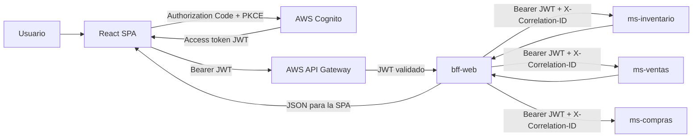

# AgroCenter Digital - bff-web

`bff-web` es la capa Backend For Frontend específica para la SPA React. Es el
único componente que el frontend debe consumir: valida identidad y permisos,
oculta las URLs privadas, propaga el contexto autenticado y compone respuestas de
los microservicios sin acceder a sus bases de datos ni duplicar lógica de negocio.

## Arquitectura



El flujo obligatorio es `React -> API Gateway -> bff-web -> microservicios`.
`ms-inventario` y `ms-ventas` deben permanecer en red privada y no configurar CORS
para navegadores.

## Defense in Depth y Cognito

API Gateway realiza la validación perimetral. El BFF vuelve a validar cada Bearer
token como OAuth2 Resource Server de Spring Security, de modo que un acceso directo
o una configuración incorrecta del gateway no omita los controles internos.

En los perfiles normales y `prod`, el decoder del BFF:

- admite exclusivamente firmas `RS256`;
- obtiene y rota las claves públicas desde `COGNITO_JWK_SET_URI` (JWKS);
- valida firma criptográfica, formato y token manipulado;
- valida `iss` contra `COGNITO_ISSUER_URI`;
- valida `exp` y `nbf` mediante los validadores estándar de Spring Security;
- exige `token_use=access`, evitando usar un ID token como credencial de API;
- valida `COGNITO_AUDIENCE` contra `aud` o contra el claim `client_id` de los
  access tokens de Cognito.

Los grupos de `cognito:groups` y el claim opcional `custom:role` se convierten a
`ROLE_CLIENTE` y `ROLE_ADMIN`. Solo esos dos nombres se aceptan como roles; los
scopes OAuth se conservan como authorities `SCOPE_*`.

El perfil `dev` es una excepción local explícita y nunca debe combinarse con
`prod`: valida HS256 con `DEV_JWT_SECRET`, issuer y audience. Esto permite reutilizar
el token local emitido por `ms-inventario` cuando ambos procesos comparten secret,
issuer y audience. No existe un emisor de tokens dentro del BFF.

## Endpoints públicos del BFF

Todos los endpoints bajo `/api/bff` requieren un JWT válido.

| Método | Ruta BFF | Rol | Destino real |
|---|---|---|---|
| `GET` | `/api/bff/catalogo` | CLIENTE, ADMIN | `GET /api/inventario/productos?activo=true` |
| `GET` | `/api/bff/productos/{id}` | CLIENTE, ADMIN | `GET /api/inventario/productos/{id}` |
| `GET` | `/api/bff/productos/sku/{sku}` | CLIENTE, ADMIN | `GET /api/inventario/productos/sku/{sku}` |
| `GET` | `/api/bff/productos/{id}/stock` | CLIENTE, ADMIN | `GET /api/inventario/productos/{id}/stock` |
| `GET` | `/api/bff/inventario` | ADMIN | `GET /api/inventario/productos` |
| `GET` | `/api/bff/inventario/stock-bajo` | ADMIN | Filtra `stockBajo` del contrato de productos |
| `POST` | `/api/bff/inventario/productos` | ADMIN | `POST /api/inventario/productos` |
| `PUT` | `/api/bff/inventario/productos/{id}` | ADMIN | `PUT /api/inventario/productos/{id}` |
| `PATCH` | `/api/bff/inventario/productos/{id}/estado` | ADMIN | `PATCH /api/inventario/productos/{id}/estado` |
| `GET` | `/api/bff/inventario/movimientos` | ADMIN | `GET /api/inventario/movimientos` |
| `GET` | `/api/bff/inventario/productos/{id}/movimientos` | ADMIN | `GET /api/inventario/productos/{id}/movimientos` |
| `POST` | `/api/bff/ventas` | CLIENTE | `POST /api/v1/ventas` |
| `GET` | `/api/bff/ventas/mis-pedidos` | CLIENTE | `GET /api/v1/ventas/mis-pedidos` |
| `GET` | `/api/bff/ventas/{id}` | CLIENTE propietario, ADMIN | `GET /api/v1/ventas/{id}` |
| `GET` | `/api/bff/admin/ventas` | ADMIN | `GET /api/v1/ventas` |
| `POST` | `/api/bff/compras` | ADMIN | `POST /api/compras` |
| `GET` | `/api/bff/compras` | ADMIN | `GET /api/compras` |
| `GET` | `/api/bff/compras/{id}` | ADMIN | `GET /api/compras/{id}` |
| `GET` | `/api/bff/admin/dashboard` | ADMIN | Agrega inventario + ventas + compras |
| `GET` | `/actuator/health` | Público en la red | Salud básica, sin detalles |

Los listados paginados aceptan `pagina` desde `0` y `tamanio` entre `1` y `100`.
El catálogo acepta `categoria` y `nombre`. El inventario administrativo también
acepta `activo`.

## Agregación del dashboard

`GET /api/bff/admin/dashboard` consulta contratos reales:

1. `ms-inventario` para la lista total y los productos cuyo propio campo
   `stockBajo` es `true`.
2. `ms-ventas` con una página mínima para obtener `totalElementos`.
3. `ms-compras` para contabilizar las órdenes devueltas por su listado real.

Ejemplo:

```json
{
  "generadoEn": "2026-08-28T20:00:00Z",
  "inventario": {
    "productos": 120,
    "productosStockBajo": 8
  },
  "ventas": {
    "ventasRegistradas": 54
  },
  "compras": {
    "comprasRegistradas": 4
  }
}
```

No se calcula `ventasHoy`, `totalHoy` ni un período de compras recientes porque los servicios
actuales no ofrecen consultas agregadas o filtradas capaces de producir esos datos
de manera completa y eficiente.

## Comunicación interna

`InventoryClient`, `SalesClient` y `PurchasesClient` concentran las llamadas con `RestClient`. Un
interceptor central extrae el JWT que Spring Security ya autenticó y lo propaga
como Bearer; nunca usa un token global, inventado o registrado en logs. El mismo
interceptor propaga `X-Correlation-ID`. `SalesClient` también envía
`Idempotency-Key`, conserva `Idempotent-Replay` y el BFF genera su propio header
`Location`, sin filtrar URLs internas.

El JWT también se propaga a `ms-compras`, aunque su implementación actual no tiene
Spring Security ni OAuth2 Resource Server y por tanto todavía no lo valida. El BFF
sí restringe todas las rutas de compras a `ADMIN`; la defensa en profundidad de ese
flujo quedará completa cuando se endurezca el microservicio interno.

Cada servicio tiene connection/response timeout independiente. Un timeout o fallo
de transporte devuelve `503`; un `5xx` mal formado devuelve `502`. Los `400`, `404`
y `409` controlados se traducen al mismo código. Si un microservicio rechaza el JWT
que el BFF ya validó, se devuelve `502` porque indica una incompatibilidad interna
de seguridad y no una sesión inválida del usuario.

## Errores

Las respuestas no incluyen stack traces ni secretos:

```json
{
  "timestamp": "2026-08-28T20:00:00Z",
  "status": 403,
  "error": "FORBIDDEN",
  "code": "FORBIDDEN",
  "message": "No tiene permisos para realizar esta operacion",
  "path": "/api/bff/inventario",
  "correlationId": "2415340f-bfe2-4f96-b8d4-7410db8ee384",
  "validationErrors": {}
}
```

- Sin token, token falso o token expirado: `401 Unauthorized`.
- JWT válido sin el rol necesario: `403 Forbidden`.
- Request o DTO inválido: `400 Bad Request`.
- Recurso inexistente: `404 Not Found`.
- Conflicto o stock insuficiente: `409 Conflict`.
- Respuesta inválida de un servicio: `502 Bad Gateway`.
- Timeout o servicio no disponible: `503 Service Unavailable`.

## Variables de entorno

| Variable | Obligatoria en prod | Uso |
|---|---:|---|
| `SERVER_PORT` | No | Puerto del BFF, por defecto `8080` |
| `COGNITO_ISSUER_URI` | Sí | Issuer exacto del User Pool |
| `COGNITO_JWK_SET_URI` | Sí | Endpoint JWKS del User Pool |
| `COGNITO_AUDIENCE` | Sí | App Client ID/audience aceptada |
| `MS_INVENTARIO_URL` | Sí | URL privada de `ms-inventario` |
| `MS_VENTAS_URL` | Sí | URL privada de `ms-ventas` |
| `MS_COMPRAS_URL` | Sí | URL privada de `ms-compras` |
| `MS_INVENTARIO_CONNECT_TIMEOUT` | No | Connection timeout; `2s` local |
| `MS_INVENTARIO_RESPONSE_TIMEOUT` | No | Response timeout; `4s` local |
| `MS_VENTAS_CONNECT_TIMEOUT` | No | Connection timeout; `2s` local |
| `MS_VENTAS_RESPONSE_TIMEOUT` | No | Response timeout; `6s` local |
| `MS_COMPRAS_CONNECT_TIMEOUT` | No | Configuración preparada |
| `MS_COMPRAS_RESPONSE_TIMEOUT` | No | Configuración preparada |
| `ALLOWED_ORIGINS` | Sí | Lista separada por comas, sin `*` |
| `SWAGGER_ENABLED` | No | OpenAPI solo para desarrollo |
| `SPRING_PROFILES_ACTIVE` | Sí | `prod` en AWS |
| `DEV_JWT_SECRET` | Solo dev | Secret local de al menos 32 caracteres |
| `DEV_JWT_ISSUER` | Solo dev | Issuer local compartido |

`.env.example` contiene solo valores ficticios. `.env`, tokens, claves, logs,
artefactos Maven e IDEs están excluidos de Git y Docker.

## Ejecución local

Requisitos: Java 21, Maven 3.9+ y los servicios de inventario/ventas activos.

Con Cognito real:

```powershell
$env:COGNITO_ISSUER_URI='https://cognito-idp.us-east-1.amazonaws.com/us-east-1_POOL'
$env:COGNITO_JWK_SET_URI="$env:COGNITO_ISSUER_URI/.well-known/jwks.json"
$env:COGNITO_AUDIENCE='APP_CLIENT_ID'
$env:MS_INVENTARIO_URL='http://localhost:8081'
$env:MS_VENTAS_URL='http://localhost:8082'
$env:ALLOWED_ORIGINS='http://localhost:3000,http://localhost:5173'
./mvnw.cmd spring-boot:run
```

Para usar los JWT locales que emite `ms-inventario` bajo perfil `dev`:

```powershell
$env:SPRING_PROFILES_ACTIVE='dev'
$env:DEV_JWT_SECRET='una-clave-local-compartida-de-al-menos-32-caracteres'
$env:DEV_JWT_ISSUER='http://localhost:8081/dev-issuer'
$env:COGNITO_AUDIENCE='agrocenter-api'
./mvnw.cmd spring-boot:run
```

Los tres procesos deben compartir `DEV_JWT_SECRET`, `DEV_JWT_ISSUER` y audience.
El endpoint emisor continúa siendo `POST http://localhost:8081/api/dev/token`;
el BFF no genera credenciales.

Ejemplos:

```http
GET http://localhost:8080/api/bff/catalogo
Authorization: Bearer <access-token>
X-Correlation-ID: demo-catalogo-001
```

```http
POST http://localhost:8080/api/bff/ventas
Authorization: Bearer <access-token-cliente>
Idempotency-Key: 550e8400-e29b-41d4-a716-446655440000
Content-Type: application/json

{
  "items": [
    {"productoId": 10, "cantidad": 2}
  ]
}
```

## Pruebas y compilación

Las pruebas no requieren AWS, PostgreSQL ni microservicios reales. Usan Spring
Security Test, MockMvc, Mockito y el servidor HTTP simulado de Spring.

```powershell
./mvnw.cmd test
./mvnw.cmd package
```

La suite cubre:

- `401` sin token, token falso y token expirado;
- `403` para CLIENTE sobre rutas ADMIN;
- acceso permitido para ADMIN y CLIENTE;
- conversión segura de grupos/scopes y validadores de audience/token use;
- validación de DTOs antes de llamar a los servicios;
- respuesta real deserializada de `InventoryClient`;
- propagación del Bearer validado y correlation ID;
- traducción de fallos de microservicios a `502`/`503`;
- agregación del dashboard.
- autorización y creación de compras para ADMIN.

## Docker

```powershell
Copy-Item .env.example .env
# Editar .env y reemplazar los valores ficticios.
docker compose up --build -d
docker compose ps
curl.exe http://localhost:8080/actuator/health
```

O construir y ejecutar directamente con Cognito:

```powershell
docker build -t agrocenter/bff-web:local .
docker run --rm -p 8080:8080 `
  -e SPRING_PROFILES_ACTIVE=prod `
  -e COGNITO_ISSUER_URI=https://cognito-idp.us-east-1.amazonaws.com/us-east-1_POOL `
  -e COGNITO_JWK_SET_URI=https://cognito-idp.us-east-1.amazonaws.com/us-east-1_POOL/.well-known/jwks.json `
  -e COGNITO_AUDIENCE=APP_CLIENT_ID `
  -e MS_INVENTARIO_URL=http://host.docker.internal:8081 `
  -e MS_VENTAS_URL=http://host.docker.internal:8082 `
  -e MS_COMPRAS_URL=http://host.docker.internal:8083 `
  -e ALLOWED_ORIGINS=http://localhost:3000 `
  agrocenter/bff-web:local
```

La imagen usa Java 21, multi-stage build, usuario no root, health check y admite
filesystem de solo lectura en Compose.

## Pendientes de AWS e integración

- crear/configurar el User Pool, App Client público sin secret y callback/logout
  URLs para Authorization Code + PKCE;
- configurar los grupos `CLIENTE` y `ADMIN` y asignarlos a usuarios;
- configurar el JWT Authorizer de API Gateway con el mismo issuer/audience;
- enrutar exclusivamente API Gateway hacia el BFF y mantener los tres servicios
  en subredes privadas/security groups restringidos;
- inyectar configuración desde el entorno/Parameter Store/Secrets Manager, nunca
  desde la imagen;
- configurar CORS en API Gateway y conservar en el BFF solo los orígenes exactos;
- publicar health checks internos y centralizar logs/métricas en CloudWatch;
- corregir y endurecer `ms-compras`: Resource Server Cognito, errores JSON,
  configuración empaquetada, timeouts y contrato correcto con inventario;
- ejecutar pruebas end-to-end con Cognito, API Gateway y los servicios desplegados.

## Limitaciones detectadas en el repositorio

- El repositorio raíz no tenía `bff-web` ni `.gitignore`; ambos fueron agregados.
- `ms-inventario` declara Spring Boot `4.1.0`, mientras `ms-ventas` usa `3.5.7`.
  El BFF usa `3.5.7` para conservar compatibilidad con el servicio de ventas y
  APIs estables de Java 21; conviene alinear versiones en una tarea separada.
- El frontend ya apunta a una única `NEXT_PUBLIC_API_BASE_URL`, pero sus pantallas
  actuales todavía no contienen llamadas concretas a estos endpoints del BFF.
- El contrato de ventas no ofrece filtro/resumen diario; el dashboard solo puede
  informar el total global sin recorrer toda la historia.
- `ms-compras` apareció durante la implementación y se integraron sus rutas reales
  `/api/compras`. Sin embargo, hoy no valida JWT, su `application.yml` está en
  `src/resources` en vez de `src/main/resources`, y su `pom.xml` solo incluye H2
  mientras ese YAML configura PostgreSQL.
- `ms-compras` intenta registrar inventario en `POST /api/inventario/movimientos`,
  ruta que no existe en `ms-inventario` (el contrato real de entrada es
  `POST /api/inventario/stock/entrada`), y además absorbe el error. Una compra puede
  responder `COMPLETADA` sin que aumente el stock; esto debe corregirse en ese
  microservicio, no en el BFF.
