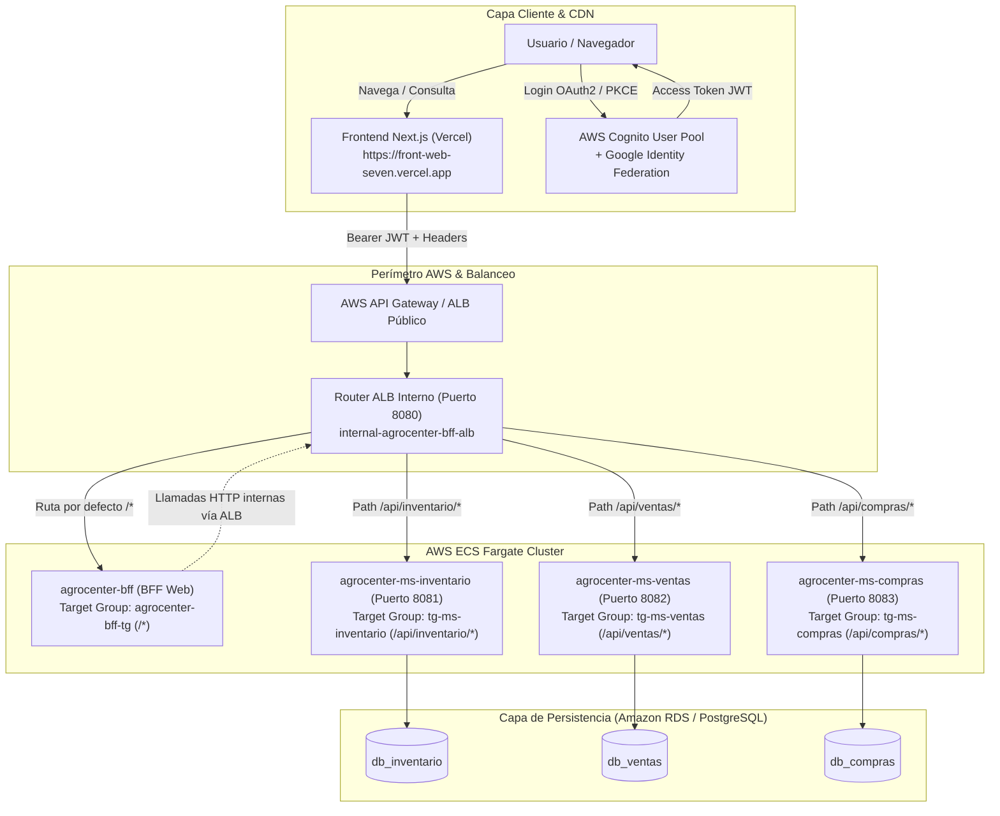
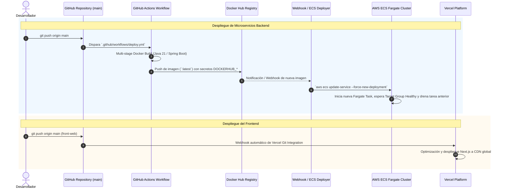

# AgroCenter Digital - Arquitectura Global & Backend For Frontend (`bff-web`)

Bienvenido a la documentación principal de **AgroCenter Digital**. Este repositorio alberga el componente **`bff-web` (Backend For Frontend)** y sirve como **guía de arquitectura macro** para todo el ecosistema de la plataforma (Frontend en Vercel, balanceador y microservicios en AWS ECS Fargate, autenticación en AWS Cognito y canalizaciones CI/CD automatizadas).

---

## 1. Visión General del Sistema y Flujo Extremo a Extremo

AgroCenter Digital está diseñado bajo una arquitectura desacoplada y nativa de la nube:



### Recorrido de una Petición
1. **Frontend (Vercel)**: La SPA React / Next.js alojada en Vercel (`https://front-web-seven.vercel.app/`) obtiene la sesión del usuario contra **AWS Cognito** (soportando usuarios directos y federados mediante Google).
2. **Invocación Segura**: Las peticiones salen con el encabezado HTTP `Authorization: Bearer <accessToken>` hacia el punto de entrada de la API.
3. **CORS & Perímetro**: El BFF valida la solicitud contra la lista blanca de orígenes de Vercel y entornos locales.
4. **Enrutamiento Interno (AWS Academy Learner Lab)**:
   - Ante las restricciones de IAM en el entorno educativo (sin permisos para Route 53 privado o Service Connect / Cloud Map), se implementó un **Application Load Balancer interno (`internal-agrocenter-bff-alb`)** escuchando en el puerto `8080`.
   - Utiliza **Path-Based Routing** para direccionar el tráfico a los Target Groups correspondientes:
     * `/api/inventario/*` $\rightarrow$ Target Group `tg-ms-inventario` (puerto 8081).
     * `/api/ventas/*` $\rightarrow$ Target Group `tg-ms-ventas` (puerto 8082).
     * `/api/compras/*` $\rightarrow$ Target Group `tg-ms-compras` (puerto 8083).
     * Regla por defecto (`/*`) $\rightarrow$ Target Group `agrocenter-bff-tg` (puerto 8080).
5. **Aislamiento de Datos (Database-per-Service)**: Cada microservicio corre en tareas dedicadas de AWS ECS Fargate y solo se conecta a su base de datos PostgreSQL asignada.

---

## 2. CI/CD, Workflows y Despliegue Automatizado

El despliegue continuo opera mediante la integración de **GitHub Actions**, **Docker Hub**, **Vercel** y **AWS ECS**:



### Componentes de Despliegue:
* **GitHub Actions (`.github/workflows/deploy.yml`)**: Presente en cada repositorio (`bff-web`, `front-web`, `ms-inventario`, `ms-ventas`, `ms-compras`), autentica contra Docker Hub y genera imágenes optimizadas en multi-stage sin incluir herramientas de desarrollo ni código fuente.
* **Vercel Git Integration**: Monitorea la rama `main` del frontend y despliega automáticamente a producción sin downtime.
* **AWS ECS Fargate**: Servicios configurados con *Rolling Update* para garantizar cero caídas (Zero-Downtime Deployment) mediante los health checks de cada Target Group (`/actuator/health`).

---

## 3. Rol Específico del `bff-web`

El BFF es la fachada especializada para la interfaz web. Sus responsabilidades son:
* **Abstracción de Microservicios**: Los navegadores nunca interactúan directamente con los puertos ni las URLs privadas de los microservicios (`ms-inventario:8081`, `ms-ventas:8082`, `ms-compras:8083`).
* **Composición y Agregación**: Construye vistas compuestas como el catálogo general (`GET /api/bff/catalogo`) y el panel de administración (`GET /api/bff/admin/dashboard`), evitando el problema de sobrecarga de peticiones (*chatty frontend*).
* **Defensa en Profundidad (Resource Server)**: Valida la criptografía del JWT antes de transmitir la solicitud a la red interna.
* **Resiliencia & Sanitización de URLs**: Maneja timeouts por microservicio, fallbacks de DNS y sanitización de plantillas URI (prevención de errores `IllegalArgumentException` por placeholders no resueltos).

---

## 4. Endpoints Expuestos por el BFF

Todos los endpoints se exponen bajo el prefijo `/api/bff`:

| Método | Ruta | Autorización | Descripción / Destino |
| :--- | :--- | :--- | :--- |
| `GET` | `/api/bff/catalogo` | **Público** / Anónimo / Autenticado | Catálogo de productos disponibles (`GET /api/inventario/productos?activo=true`) |
| `GET` | `/api/bff/productos/{id}` | **Público** / Anónimo / Autenticado | Detalle de producto (`GET /api/inventario/productos/{id}`) |
| `GET` | `/api/bff/productos/sku/{sku}` | **Público** / Anónimo / Autenticado | Detalle por SKU (`GET /api/inventario/productos/sku/{sku}`) |
| `GET` | `/api/bff/productos/{id}/stock`| **Público** / Anónimo / Autenticado | Existencias de producto (`GET /api/inventario/productos/{id}/stock`) |
| `GET` | `/api/bff/inventario` | `ROLE_ADMIN` | Gestión administrativa completa de inventario |
| `GET` | `/api/bff/inventario/stock-bajo` | `ROLE_ADMIN` | Listado filtrado de productos con stock crítico |
| `POST` | `/api/bff/inventario/productos` | `ROLE_ADMIN` | Creación de productos en inventario |
| `PUT` | `/api/bff/inventario/productos/{id}` | `ROLE_ADMIN` | Actualización de productos |
| `PATCH` | `/api/bff/inventario/productos/{id}/estado` | `ROLE_ADMIN` | Activación o desactivación |
| `GET` | `/api/bff/inventario/movimientos` | `ROLE_ADMIN` | Historial auditable de movimientos de stock |
| `POST` | `/api/bff/ventas` | `ROLE_CLIENTE` | Registro de pedido/venta (`POST /api/v1/ventas`) |
| `GET` | `/api/bff/ventas/mis-pedidos` | `ROLE_CLIENTE` | Historial de pedidos del cliente autenticado |
| `GET` | `/api/bff/ventas/{id}` | Propietario o `ROLE_ADMIN` | Detalle de orden de venta |
| `GET` | `/api/bff/admin/ventas` | `ROLE_ADMIN` | Reporte global de ventas |
| `POST` | `/api/bff/compras` | `ROLE_ADMIN` | Registro de orden de compra a proveedores |
| `GET` | `/api/bff/compras` | `ROLE_ADMIN` | Consulta general de compras |
| `GET` | `/api/bff/compras/{id}` | `ROLE_ADMIN` | Consulta de orden de compra por ID |
| `GET` | `/api/bff/admin/dashboard` | `ROLE_ADMIN` | Agregación consolidada (Inventario + Ventas + Compras) |
| `GET` | `/actuator/health` | **Público** | Health check básico de Fargate y ALB |

---

## 5. Matriz de Configuración y Variables de Entorno

| Variable | Obligatoria en Prod | Descripción | Valor / Ejemplo |
| :--- | :---: | :--- | :--- |
| `SERVER_PORT` | No | Puerto HTTP del BFF | `8080` |
| `SPRING_PROFILES_ACTIVE` | **Sí** | Perfil Spring activo | `prod` (o `dev` en local) |
| `COGNITO_ISSUER_URI` | **Sí** | Issuer del User Pool en AWS | `https://cognito-idp.us-east-1.amazonaws.com/us-east-1_DBCbjL67J` |
| `COGNITO_JWK_SET_URI` | **Sí** | Endpoint público JWKS de Cognito | `${COGNITO_ISSUER_URI}/.well-known/jwks.json` |
| `COGNITO_AUDIENCE` | **Sí** | App Client ID aceptado | `tu_cognito_app_client_id` |
| `ALLOWED_ORIGINS` | **Sí** | Lista blanca CORS para frontend | `https://front-web-seven.vercel.app,http://localhost:3000` |
| `MS_INVENTARIO_URL` | **Sí** | URL base de inventario (vía ALB o DNS) | `http://internal-agrocenter-bff-alb-...:8080` |
| `MS_VENTAS_URL` | **Sí** | URL base de ventas (vía ALB o DNS) | `http://internal-agrocenter-bff-alb-...:8080` |
| `MS_COMPRAS_URL` | **Sí** | URL base de compras (vía ALB o DNS) | `http://internal-agrocenter-bff-alb-...:8080` |
| `MS_INVENTARIO_CONNECT_TIMEOUT` | No | Timeout de conexión HTTP | `2s` |
| `MS_INVENTARIO_RESPONSE_TIMEOUT` | No | Timeout de lectura HTTP | `5s` |

---

## 6. Ejecución Local y Desarrollo

### Pruebas Automatizadas
Para ejecutar toda la suite de pruebas unitarias y de integración de seguridad del BFF:
```bash
./mvnw clean test
```

### Ejecución con Perfil Local / Docker
```bash
cp .env.example .env
docker compose up --build -d
curl http://localhost:8080/actuator/health
```
